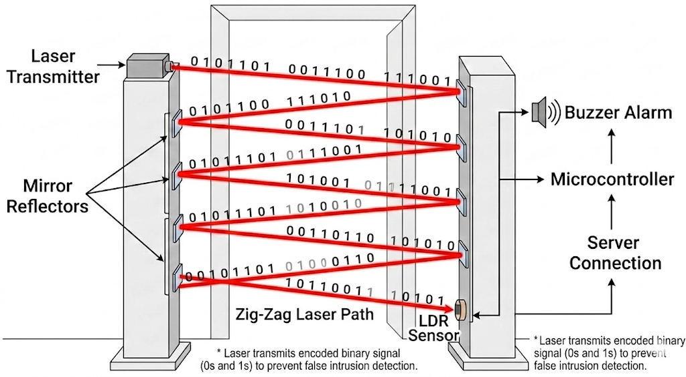
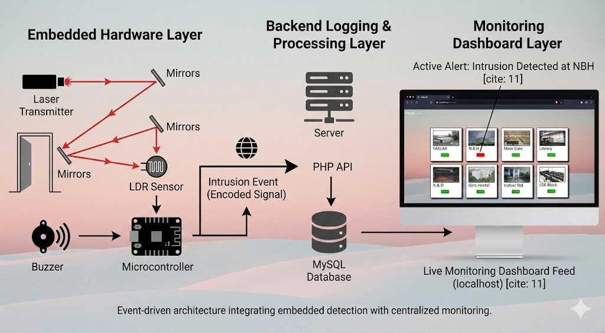

# LiFi-Based Intrusion Detection System

An embedded optical intrusion detection system that uses a laser–LDR alignment mechanism with encoded binary signaling to detect unauthorized entry and log events in a centralized monitoring dashboard.

This project demonstrates hardware-level signal validation, event-driven embedded processing, backend logging infrastructure, and real-time web monitoring.

---

## Hardware Design

The system consists of two opposing security pedestals placed at entry points.

A single laser transmitter emits a beam that reflects across multiple mirror reflectors in a zig-zag pattern, forming a structured optical detection grid across the doorway. The final reflected beam is received by an LDR (Light Dependent Resistor) positioned at the bottom of the opposite pedestal.

### Key Design Decisions

- **Mirror-based beam expansion** eliminates the need for multiple laser modules.
- **Zig-zag optical routing** creates a wider intrusion detection field.
- **Binary encoded laser pulses (0s and 1s)** are transmitted instead of constant light.
- The microcontroller validates the received signal pattern before triggering an intrusion event.

This significantly reduces false positives caused by ambient light variations.

---

## System Architecture

The system follows a layered, event-driven architecture:

### 1️⃣ Embedded Hardware Layer
- Laser transmitter
- Mirror reflector array
- LDR sensor
- Microcontroller
- Buzzer alarm

The microcontroller continuously monitors the encoded optical signal and performs threshold and pattern validation before generating an intrusion event.

### 2️⃣ Backend Logging & Processing Layer
- PHP API
- Server processing
- MySQL database

When an intrusion is confirmed:
- An encoded event signal is sent to the backend
- The event is stored with location and timestamp
- Data persistence enables centralized tracking

### 3️⃣ Monitoring Dashboard Layer
- Real-time location panels
- Red/Green intrusion indicators
- Historical log tracking
- Calendar-based event filtering
- Authentication-controlled access

This architecture separates physical detection, event processing, and visualization into independent layers for modular scalability.

---

## Technologies Used

### Embedded Systems
- Arduino / Microcontroller Programming (C/C++)
- Analog signal threshold calibration
- Binary pulse validation
- Debounce filtering logic

### Backend
- PHP
- MySQL

### Frontend
- HTML
- CSS
- JavaScript

---

## Engineering Highlights

- Optical intrusion detection using mirror-based beam expansion
- Binary signal encoding for interference resistance
- Real-time event-driven architecture
- Layered system design (Physical → Processing → Monitoring)
- Hardware-software integration

---

## Future Improvements

- Replace HTTP polling with WebSocket push notifications
- Deploy backend to cloud infrastructure
- Add SMS/email alert integration
- Implement multi-node distributed sensor grid
- Integrate camera verification module

---

## Author

Nithin Chakravarthi Bandi  
MEng Computer Science – University of Cincinnati  
Former AI/ML Intern @ Mobius Networks  
Former Research Intern @ IERDC
